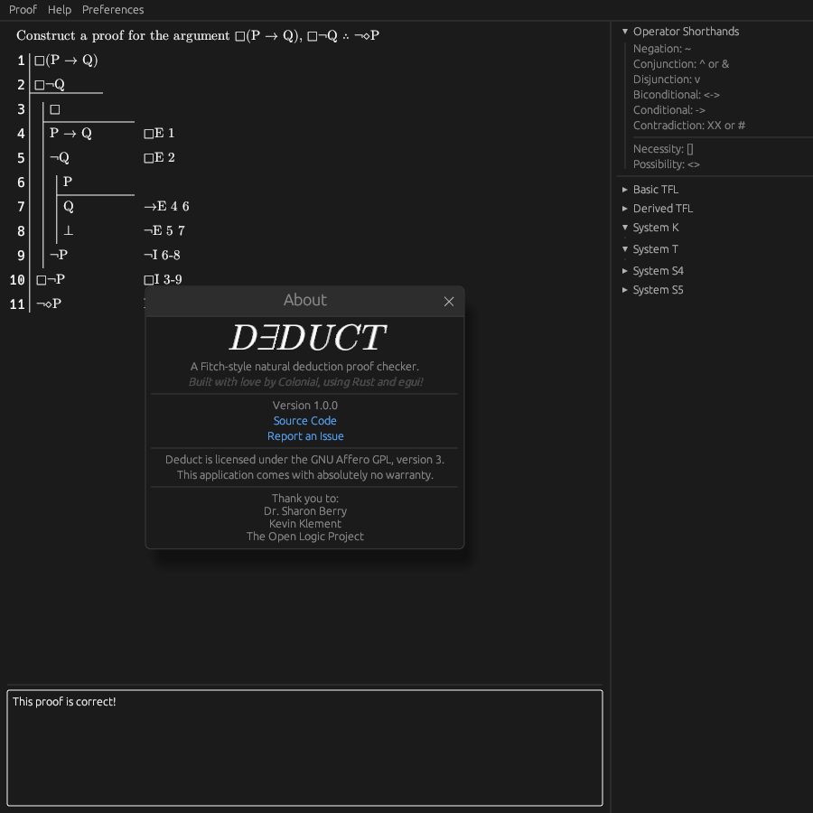

<p align="center">

</p>
<h3 align="center">A Fitch-style natural deduction proof checker, with support for modal logic.</h3>

<p align="center">


</p>

## Features
- Support for multiple proof systems
  - TFL (basic and derived rulesets)
  - Modal logic (systems $K$, $T$, $S_4$, and $S_5$)
- Cross-platform thanks to `egui`; runs on all major operating systems and in the browser
- Keyboard shortcuts and automatic checker execution

## Installation

### Web Version (Recommended)
Deduct is available as a web app [here](https://colonial-dev.github.io/deduct/). Use a laptop or desktop for the best experience.

### Precompiled Binaries
Precompiled versions of Deduct are available for:
- Windows (note that, although unlikely, you may need to install the Microsoft Visual C/++ Redistributables)
- macOS
- Linux (compiled against `x86_64-unknown-linux-musl`, which should Just Work™ on most distributions.) 

All binaries can be found in the [releases](https://github.com/Colonial-Dev/deduct/releases) section.

### From Source
Dependencies:
- The [Rust programming language](https://rustup.rs/).
- A C/C++ toolchain (such as `gcc`.)

Just use `cargo install`, and Deduct will be compiled and added to your `PATH`.
```sh
cargo install --locked --git https://github.com/Colonial-Dev/deduct deduct
```

## Getting Started
I recommend you use the [web version](https://colonial-dev.github.io/deduct/).

You can start a new proof by navigating to `Proof` > `New...` in the menu bar. Select which rulesets you'd like to enable, enter your premises (if any) and conclusion, and hit `Create proof`. If your sentences are well formed, the window will close and you can start working.

### Tips
- If you would prefer light mode or a larger UI, both can be adjusted under `Preferences` in the menu bar. Your choices will be remembered even if you close and re-open Deduct.
- You can review logical operator shorthands and proof rules in the sidebar.
- You can restart the proof and change your argument (if needed) under the `Proof` dropdown in the menu bar.

### Control
- You can add and remove lines or subproofs by hovering over the relevant line and clicking the buttons that appear to the right of the citation field.
- All insertion actions also have keyboard shortcuts. The exact keys vary between platforms; look at `Help` > `Shortcuts` in the menu bar to find yours.
- `TAB` works like you would expect, including inside the proof UI. (Example: while editing a sentence, `TAB` will move the cursor to its citation field.)
- Whenever you edit a field or remove a line, the proof checker will automatically execute and display its output at the bottom of the window. 
  - (Adding a line or subproof does not trigger the checker.)

## Acknowledgements
Thank you to:
- Dr. Sharon Berry, for inspiring me to do this project and an excellent semester in P251
- Keven Klement and the Open Logic Project, for their excellent textbook and [proof checker](https://proofs.openlogicproject.org)